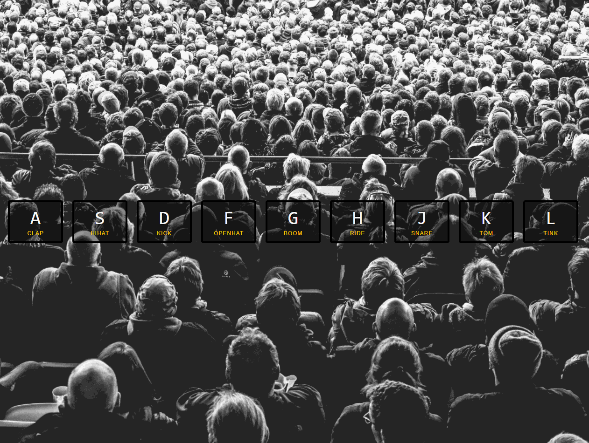

# Javascript-drum-kit
In this exercise, we build a javascript drumkit in the browser. \
The corresponding key on the keyboard plays a sound and animates the button. \
You can also click the drumkit buttons.\
To use this, please download the folder and simply open the index file in your browser. \

