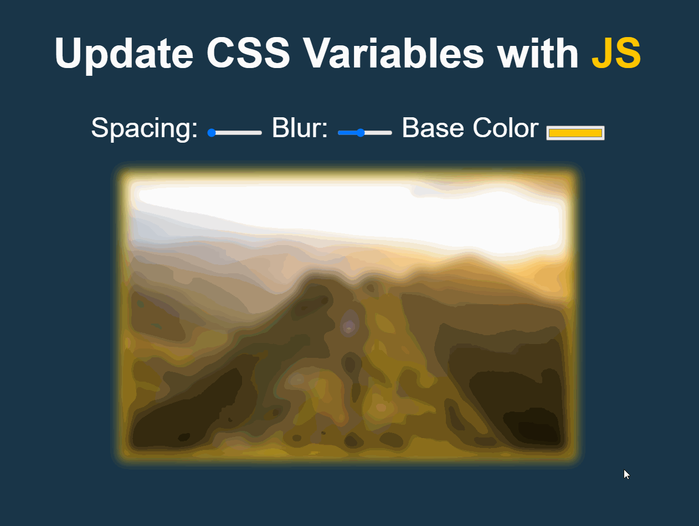

# CSS Variables
In this exercise, we explore CSS variables and use it to create inputs that manipulate an element.\
To use this, please download the folder and simply open the index file in your browser. \

