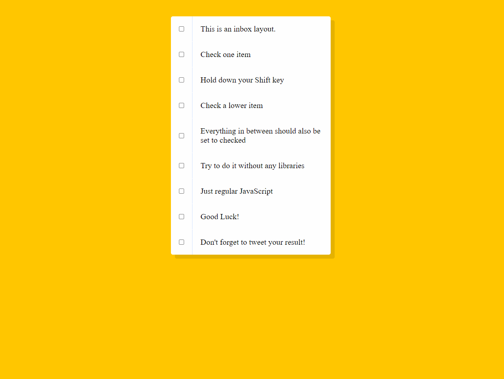

# Hold Shift and Check Checkboxes
In this exercise, we build a checklist which can be have multiple checkboxes selected at the same time using the shift key. \
To use this, please download the folder and simply open the index file in your browser. \

