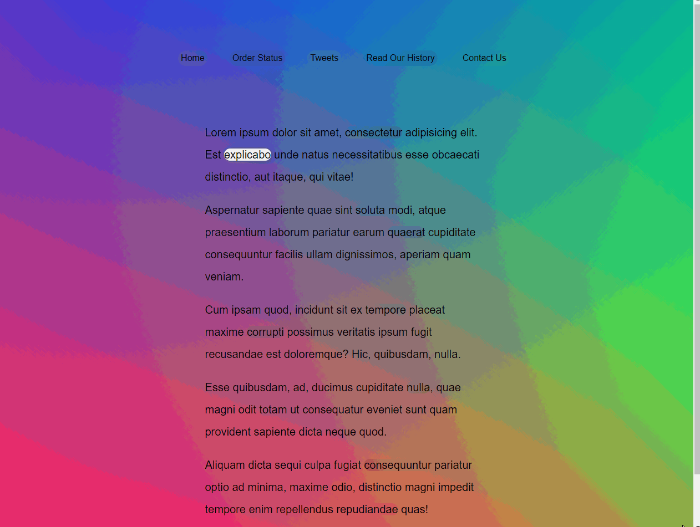

# Follow Along Link Highlighter
In this exercise, we use CSS and Javascript to follow the cursor and highlight important links. \
To use this, please download the folder and simply open the index file in your browser. \

